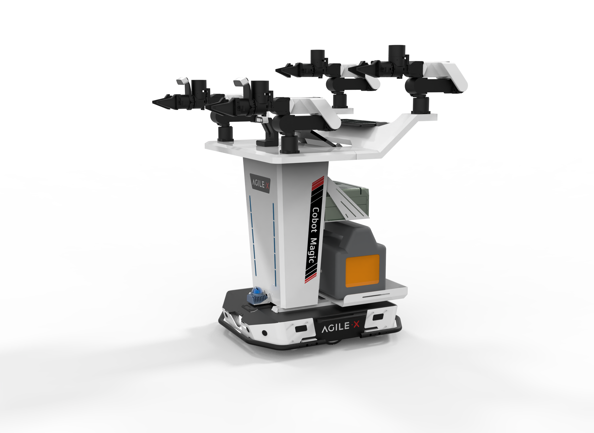
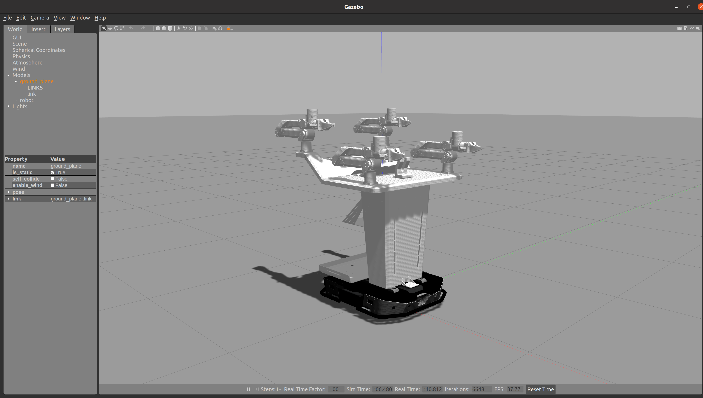
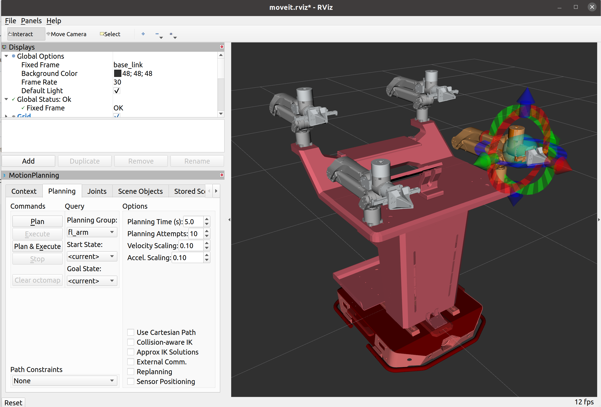
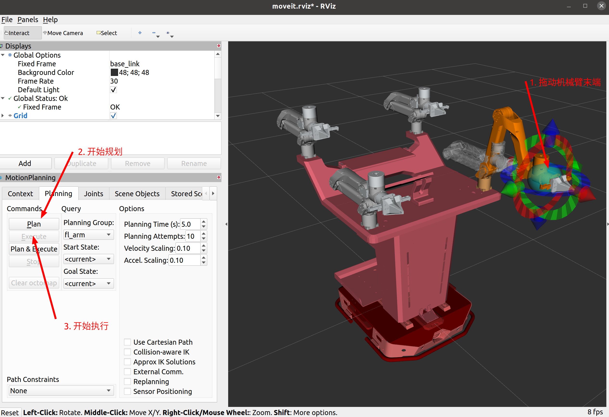
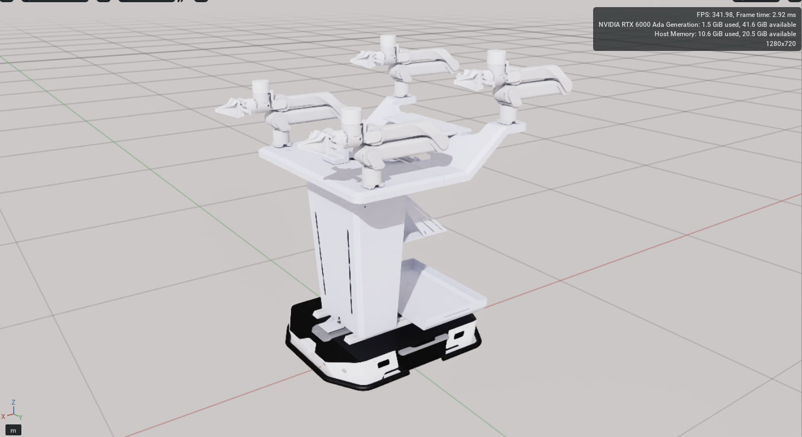

# mobile_aloha_sim




## Test environment

ubuntu 20.04

ros noetic

gazebo version 11

## Compile the package

``` bash
mkdir aloha_sim_ws
cd aloha_sim_ws
mkdir src
cd src
git clone https://github.com/agilexrobotics/mobile_aloha_sim
cd ..
catkin_make
```

## File Directory

```
├── aloha_description
│   ├── aloha
│   ├── arx5_description
│   ├── arx5-urdf
│   │   ├── arx5
│   │   └── arx5p2
│   ├── livox_laser_simulation
│   └── tracer
│       ├── image
│       ├── tracer_description
│       └── tracer_gazebo_sim
├── aloha_mujoco
|   └── aloha
|       ├── CMakeLists.txt
|       ├── meshes_mujoco
|       │   ├── aloha_v1.xml
|       │   └── meshes_mujoco
|       ├── package.xml
|       └── scripts
|           ├── aloha_ctrl.py
|           └── aloha_ctrl_test.py
├── arx5_moveit_config
│   ├── config
│   └── launch
└── doc
```

Where aloha_mujoco is the implementation under the mujoco emulation, please refer to the [README](. /aloha_mujoco/README.MD).

## Start the emulation

### gazebo emulation

``` bash
roslaunch arx5_moveit_config demo_gazebo.launch
```







After starting the gazebo simulation there are two windows, one for the gazebo physics simulation and one for rviz, in the rviz window you can call the moveit component to plan the robot arm.

In the gazebo simulation window, the right side of the screen shows the real-time physical simulation environment, the position information of the arm and the kinematics simulation information are displayed here, gazebo will also feedback the state of the simulated arm and execute the control angle sent by the planner.

In the rviz simulation window, the lower left side shows the ui interface of the moveit component, where different planning groups can be selected to control different robotic arms and grippers. The right window shows the real time position of the arm, which is provided by gazebo simulation.

#### Mobile Chassis

``` bash
rosrun teleop_twist_keyboard teleop_twist_keyboard.py
```

Open the keyboard control node to send speed control to move the chassis.

#### Moving the arm

Drag the teach ball in the rviz interface and operate as shown, the robot arm will calculate the joint angle and robot arm trajectory according to the position of the target end gripper jaws



Note that after clicking Plan to start planning, the system needs time to calculate, wait for the Execute button to change from grey to black, click to execute the trajectory just planned.

### rviz simulation

The only difference between rviz simulation and gazebo simulation is that instead of launching the physical simulation engine gazebo, only the data visualisation platform rviz is launched.

``` bash
roslaunch arx5_moveit_config demo.launch
```

The interface of rviz is the same as that of gazebo simulation, just follow the above steps.


## isaac sim simulation

### isaac sim download

Download isaac sim from https://developer.nvidia.com/isaac-sim, then search for isaac sim in ‘exchanges/exchange’ in omniverse_launcher and download it. isaac sim

This repository provides a urdf for isaac sim import: aloha_isaac_sim/urdf/arx5_description_isaac.urdf

Start isaac sim in omniverse_launcher, and then on the upper toolbar isaac utils->workflows->URDF Importer->In the pop-up window, find Import->Input File and select urdf path->click Import.

The effect after importing isaac sim is as follows:


